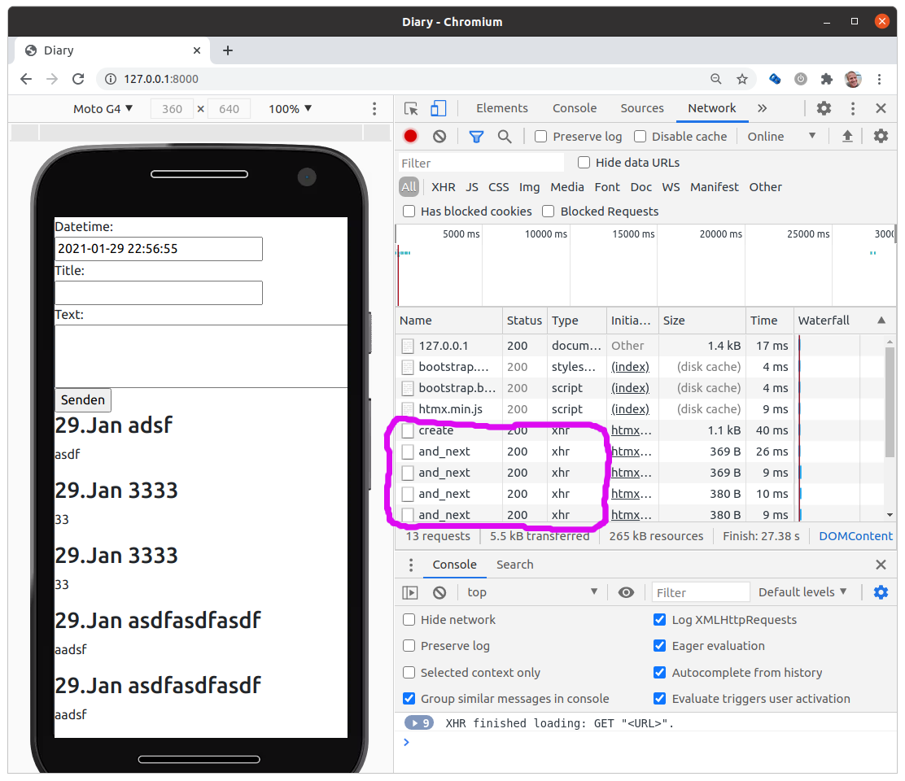

# django-htmx-fun

A small Django application to advertise the fun [htmx](//htmx.org) can bring you.

It implements a Single-Page-Application for writing a diary.

The entries in the diary database get lazy loaded (endless scrolling) via [hx-trigger="revealed"](https://htmx.org/attributes/hx-trigger/)

# Why I love htmx?

If you look into the past then one thing is clear: stateless has won. Nobody starts a new project with [Corba](https://en.wikipedia.org/wiki/Common_Object_Request_Broker_Architecture)
these days. Stateless http is the winner.

I don't understand why JavaScript based frontend frameworks seem to be the only way for new projects.

I want the client/browser to be SSS (simple, stupid and stateless).

I need to validate my data on the server anyway. So why should I validate them on the client?

The Django Forms library has all you need to write database focused applications.

Sending HTML fragements over the wire keeps my application simple.

There is just one thing which is outdated (although it is still perfectly fine). The need
for a full page refresh after submitting a form.

I want html pages with several small forms and I want to load and submit each of them 
individually. This does not mean I want to write a Single-Page-Application. There
are more colors than black and white. 

For more about htmx see the homepage: [htmx.org](//htmx.org)

[HTMX: Frontend Revolution (Slides from DjangoCon EU 2021)](https://docs.google.com/presentation/d/1Gx1UGVAgD2ALLOucsIm9myF5mDflbP06-M6_d-RdZAY/edit?usp=sharing)

## Install

If you want to install my small htmx demo application:

```
python3 -m venv django-htmx-fun-env
cd django-htmx-fun-env
. bin/activate
pip install -e git+ssh://git@github.com/guettli/django-htmx-fun.git#egg=django_htmx_fun
```

The source code is now in src/django-htmx-fun/

## Run Database Migrations

```
manage.py migrate
```

## Start Webserver
```
manage.py runserver
```

Diary: http://127.0.0.1:8000/

## Admin
```
manage.py createsuperuser

```
Admin: http://127.0.0.1:8000/admin

## Screenshot



In devtools you can see the lazy loading of the endless scrolling

... All this is possible without writing a single line of JavaScript :-)

## Naming Pattern

Here is my personal naming pattern, which helps me to read the source more easily

**_page():** 

Function based view. 

`foo_page(request, ...)`. 

Returns a HttpResponse with a full page. 

URL: `/foo`

---

**_hx():**

Function based view.

`foo_hx(request, ...)`

This method should be called via HTTP-GET. Returns a HttpResponse which only contains a HTML fragment. 

URL: `/foo_hx`

---

**_hxpost():**

Function based view.

`foo_hxpost(request, ...)`

This methods should be called via HTTP-POST. Returns a HttpResponse which only 
contains a HTML fragment. 

URL: `/foo_hxpost`


---

**_html():**

Python method which returns a HTML SafeString. 

Usually created via [format_html()](https://docs.djangoproject.com/en/dev/ref/utils/#django.utils.html.format_html).

## Opinionated Best Practices

I like it conditionless. I try to avoid to have to many "if" and "else".

I avoid to use `if request.method == 'POST'`.

I don't use the special http headers which get added by htmx. I avoid this (pseudo code): "if request is a htmx request, then ...".
Instead I create two endpoints: One which returns a full page, one which returns a fragment.


## Pull Requests are welcome

You have an idea how to improve this example? Great! Just do it, provide a pull request and I will merge it.

## Related

* [Güttli Django Tips](https://github.com/guettli/django-tips)
* [Güttli's opinionated Python Tips](https://github.com/guettli/python-tips)
* [Güttli working-out-loud](https://github.com/guettli/wol)
* [Güttli's Programming Guidelines (long)](https://github.com/guettli/programming-guidelines)

